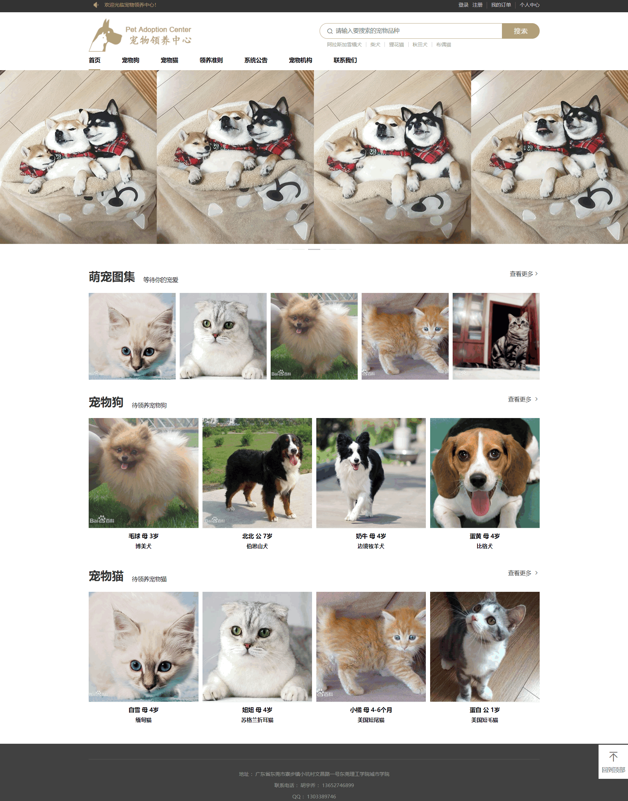
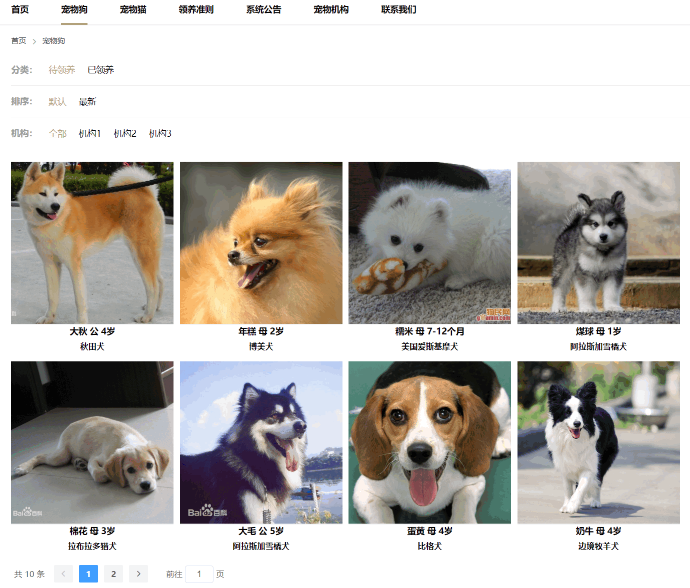
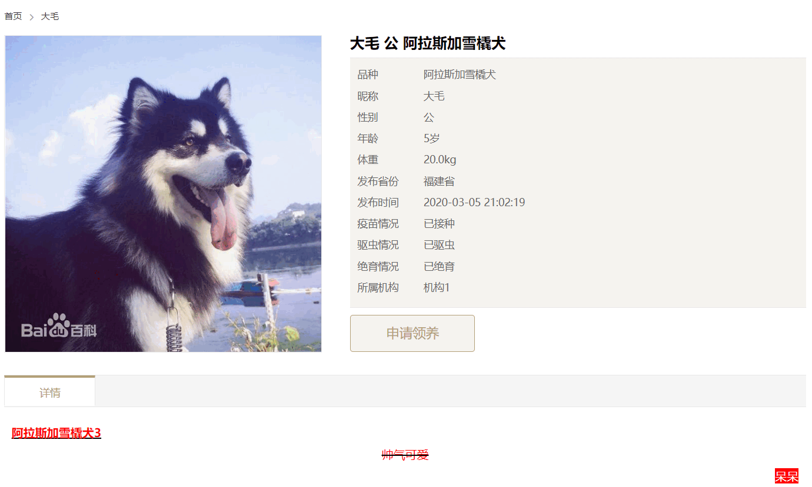
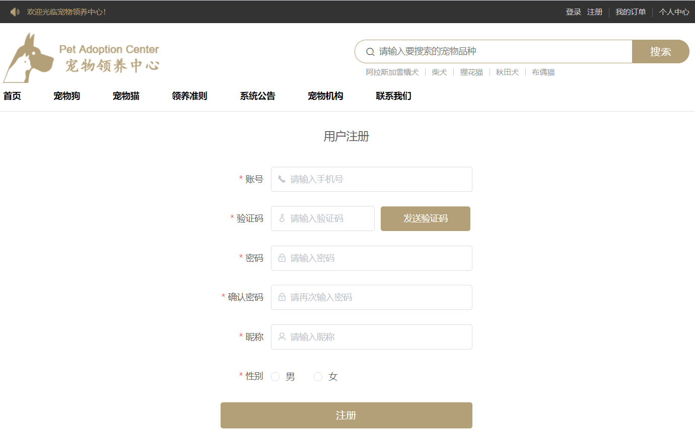
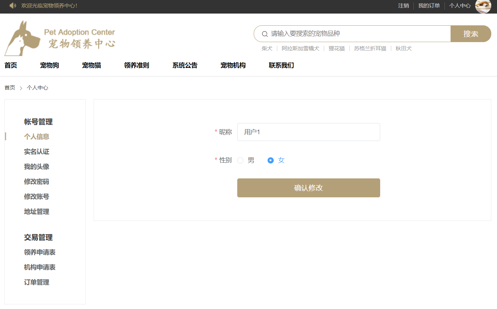
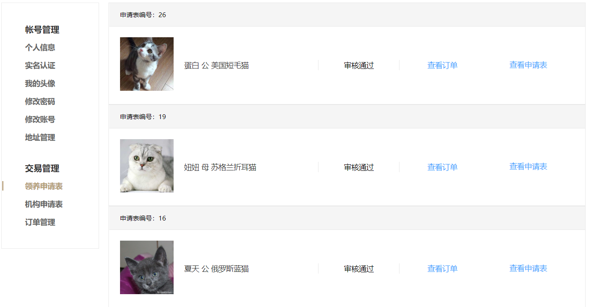

###基于Node.js的宠物领养系统的设计与开发
####1.系统简介
本系统是一个基于Node.js的宠物领养系统，分为前台门户模块、宠物机构模块、系统管理员模块。
前台门户模块包括注册登录、个人资料管理、宠物搜索、宠物领养、订单管理、机构申请等功能，地址为https://github.com/Rita-hyq/adoption-front-user
宠物机构模块包括机构资料管理、宠物信息管理、领养审核、订单管理、查看数据报表等功能，地址为https://github.com/Rita-hyq/adoption-front-organization
系统管理员模块包括用户管理、宠物机构管理、宠物管理、订单管理、首页管理、系统公告管理、查看数据报表等功能，地址为https://github.com/Rita-hyq/adoption-front-admin
####2.后端技术选型
运行环境：Node.js
Web框架：Koa2
数据库：MySQL 8.0、Redis 3.2
身份认证框架：jsonwebtoken 8.5.1
####3.前端技术选型
核心框架：Vue.js 2.6.10
路由框架：vue-router 3.1.3
状态管理框架：Vuex 3.0.1
UI框架：Element-ui 2.13.0
HTTP请求框架：Axios 0.19.0
富文本编辑器：Tinymce 4.7.5
####4.运行截图
前台门户模块

宠物机构模块

系统管理员模块

